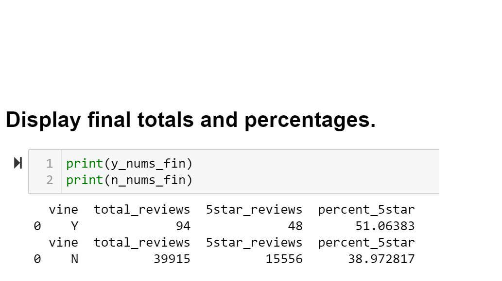

# Amazon_Vine_Analysis

Module 16

Laurina LaStella

2022 October

---
---

## Overview of the analysis:

The Amazon Vine program is a service that allows manufacturers and publishers to receive reviews for their products. Companies pay a small fee to Amazon and provide products to Amazon Vine members, who are then required to publish a review.

In this project, we had access to approximately 50 datasets. Each one contains reviews of a specific product.

*I initially picked the "books_v1.02" dataset, and used PySpark to perform the ETL process to extract the dataset, transform the data, connect to an AWS RDS instance, and load the transformed data into pgAdmin.*

*This dataset processed just fine for Deliverable 1. But when I loaded it into Pandas/Jupyter Notebook for Deliverable 2, and applied the criteria, there were zero Vine reviews.*

*At that point, I switched my selection to "Video_Games_v1_00" which had enough Vine reviews to complete this assignment. In the file "Amazon_Reviews_ETL_redux.ipynb" I repeated enough of the ETL process to push the new "vine_table" file to pgAdmin for the rest of this process.*

Next, I used Pandas to determine if there is any bias toward favorable reviews from Vine members in the dataset.

---
---

## Results:
- How many Vine reviews and non-Vine reviews were there?
    - Vine: 94
    - Non-Vine: 39,915
- How many Vine reviews were 5 stars? How many non-Vine reviews were 5 stars?
    - Vine: 48
    - Non-Vine: 15,556
- What percentage of Vine reviews were 5 stars? What percentage of non-Vine reviews were 5 stars?
    - Vine: 51%
    - Non-Vine: 39%

---
---

## Summary: 
- Based on this dataset, there is noticable positivity bias in the Vine reviews:
    - Percentages of 5-star reviews:
        - Vine: 51%
        - Non-Vine: 39%
- Suggested additional analysis:
    - Group by Customer, then apply the rest of these criteria. See if there are Vine reviewers who are more biased in their reviews.

